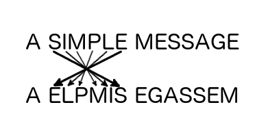

# Lesson 0 - CIA Triad \(Lesson Plan\)

|  |  |
| --- | --- |
| **Course:** | Introduction to Cyberspace |
| **Lesson:** | Introduction to the CIA Triad |
| **Intensity:** | Low |
| **Duration:** | 1.0 hour |

## LEARNING OBJECTIVES

* Recall and explain each part of the **CIA triad**
* Define **confidentiality**
* Identify methods of protecting messages using "classical cryptography"
* Identify methods of protecting messages and data using "modern cryptography"

## SUMMARY OF TASKS

### The CIA Triad

* Define each part of the CIA Triad
  * **Confidentiality** - keeping the data secure \(e.g. encryption\)
  * **Integrity** - preventing unauthorized modifications
  * **Availability** - allowing authorized access
* A common abstraction for all cybersecurity operations

### Confidentiality

* Confidentiality is the process of keeping data private from unauthorized access.
* We commonly use the principle of _least privilege_ which implies that access to resources are on a "need to know" or "need to access" basis
  * **Example:** Alice is an employee that works in the Sales department. Her primary responsibility is to make calls to prospective clients. Should she have administrator access to her workstation and servers within the company? No.

### Basic Cryptography Terms

* **Cipher** - an established technique to hide or disguise a message; a code
* **Key** - a predetermined secret used to secure a message
* **Plaintext** - a message in its original readable format
* **Ciphertext** - a message in a coded form
* **Encrypt** - the process of using a key and cipher to convert plaintext into ciphertext
* **Decrypt** - the process of using a key and cipher to convert ciphertext into plaintext

### Securing Messages - Classical cryptography

* **Caesar cipher** - substitution cipher
  * A process where each plaintext letter is replaced a letter based on a fixed number position within the alphabet
  * The following table uses a shifting number of 3. So the ciphertext of the letter 'A' = 'D'

| Plaintext | ABCDEFGHIJKLMNOPQRSTUVWXYZ |
| --- | --- |
| Ciphertext | DEFGHIJKLMNOPQRSTUVWXYZABC |

* **Transposition Cipher**
  * Simply moves the letters around

* Issues with classical cryptography
  * Average citizen in ancient Greek and Roman times could not read
  * Spaces in message could lead to determining the cipher
  * Modern computing can break these types of ciphers within seconds

### Classroom Examples

* Use the phase "CAP CADETS HAVE INTEGRITY"
  * Secure this message using a substitution cipher with a shift number of 5
    * Write out the alphabet on the classroom board
  * Secure this message using a transposition cipher
* Discuss the problems using this type of cryptography today

### Securing Messages - Modern cryptography

* Discussion about the Emigma machine
  * During WWII, the Germans created the enigma to secure messages in the field
  * The cipher used to create secured messages was "the secret"
  * Allied forces were able to capture the enigma and reverse engineer the cipher
  * Once "cracked," allied forces were able to decrypt all German and Axis power messages that used the Enigma
* Lessons learned
  * The cipher should not be "the secret"
  * Make the cipher a known algorithm 
  * Use a "key" along with a cipher to encrypt messages
  * Keep the key secret

## EVALUATION CRITERIA

Students will participate in classroom instruction and various exercises

## RESOURCES

[Crypto Corner - Transposition Ciphers](http://crypto.interactive-maths.com/simple-transposition-ciphers.html)  
 [Crypto Corner - Caesar Shift Cipher](http://crypto.interactive-maths.com/caesar-shift-cipher.html)  

## REFERENCES

[Caesar Cipher - Wikipedia](https://en.wikipedia.org/wiki/Caesar_cipher)  
 [Cryptography - Wikipedia](https://en.wikipedia.org/wiki/Cryptography)  
 [Cryptanalysis - Wikipedia](https://en.wikipedia.org/wiki/Cryptanalysis)  
 [The Enigma - Wikipedia](https://en.wikipedia.org/wiki/Enigma_machine)  
 [Alan Turing - Wikipedia](https://en.wikipedia.org/wiki/Alan_Turing#Cryptanalysis)  

